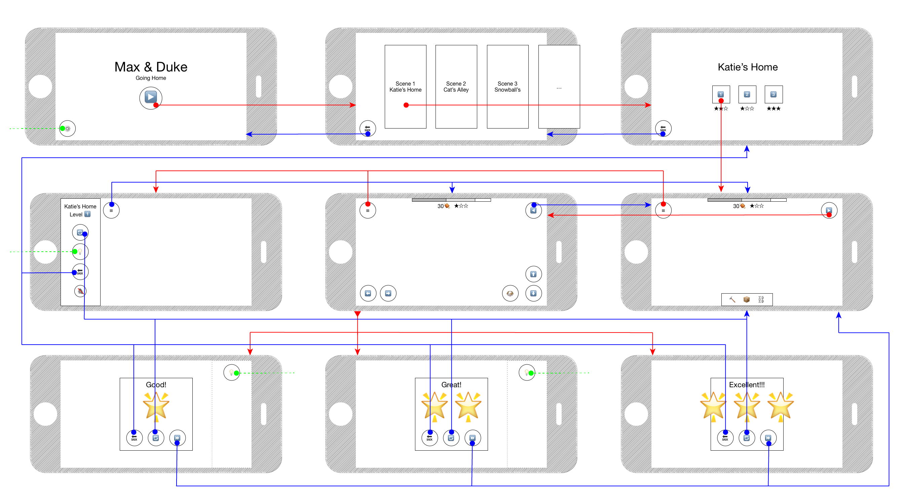
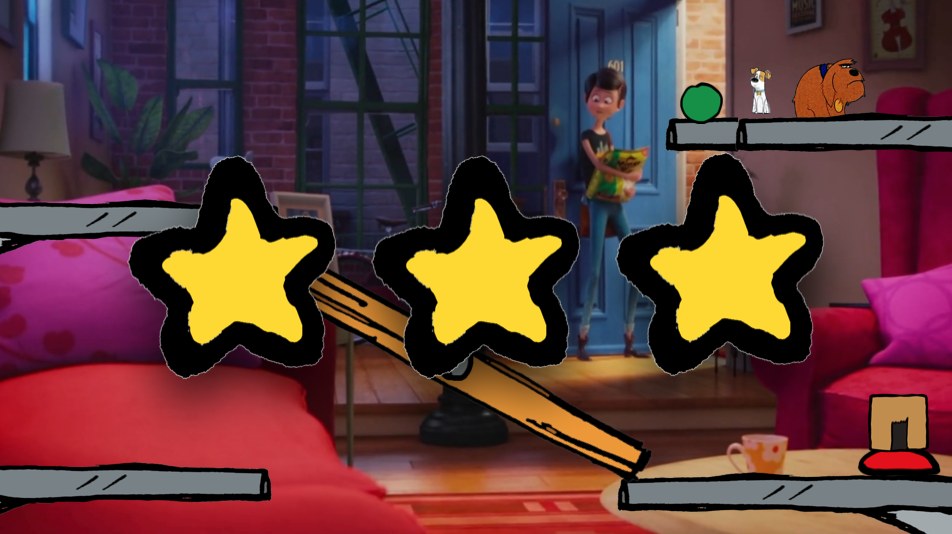

# Game Design Document for *M.A.D.*

## Overview 
*Max & Duke* is a physics puzzle game which run on iOS devices. Our idea came from the animation, [The Secret Life of Pets](http://www.imdb.com/title/tt2709768/), which struck the film industry on 2016 summer. In the movie as well as the game, Max and Duke are two dogs and perform as two main characters. 

In this game, the player should configure a route for Max and Duke and help them to reach the destination. The player can set the tools to help the character get through obstacles, which will take the cost of the money (bones in the game scene). Player can also control the two characters to do physical moves like jump, run, etc. The difficulty lies in how to balance the tool cost and character control. As to say, you should use minimum tool cost and consider more on character operation to reach the goal.

## User Interface
### 🗺 App Map 

||||
|---|---|---|
| 1 | 2 | 3 |
| 4 | 5 | 6 |
| 7 | 8 | 9 |

### 📱 Screens 

1. Main
	- Game name
	- **Play** button --> Screen 2
	- **Settings** button (--> TBD)
2. Scenes
	- Six scenes --> Screen 3
	- **Back** button --> Screen 1
3. Levels
	- Scene name
	- Three levels with stars --> Screen 6
	- **Back** button --> Screen 2
4. Game Pause
	- Sidebar
		- Level name
		- **Reset Everything** button --> Screen 6 (New Game)
		- **Hints** button (--> TBD)
		- **Back** button --> Screen 3
	- **Hamburger** (Menu) Button --> Screen 5 / 6 (Resume Game)
5. Game Control
	- **Hamburger** (Menu) Button --> Screen 4 (show sidebar)
	- **Arrow** buttons
		- **Left** button
		- **Right** button
		- **Up** button
		- **Down** button
	- **Switch Character** button, switching / selecting between
		- Max
		- Duke
	- Status bar
		- Cost bar
		- Cost in bones
		- Stars
	- **Go Set** button --> Screen 6
	- ***Complete this level*** --> Screen 7 / 8 / 9
6. Game Set
	- **Hamburger** (Menu) Button --> Screen 4 (show sidebar)
	- Status bar
		- Cost bar
		- Cost in bones
		- Stars
	- **Go Control** button --> Screen 5
	- Toolbox
		- Tools available in this level 	
7. 8. 9. Level Completed
	- Modal window
		- "Cheering" words
		- Stars
		- **Back** button --> Screen 3
		- **Replay** button --> Screen 6 (Replay this level with previous settings)
		- **Next** button --> Screen 6 (New game)
	- Sidebar
		- **Hints** button, only available when getting less than three stars (--> TBD)	

### 🎨 Artwork 
Most of the artwork is based on that from the movie.
Here is a sample screen short:

## Gameplay
### 🎚 Scenes and Levels 

In the environment, there are some things besides the tools from toolbox that can be used. For example, when we hit some triggers, the conveyer belt might transmit in different directions, or a stone can move upward and downward automatically. 

So far in the game, there are six scenes selected from the movie. 

***SPOILER ALERTS!!!***

Our first scene is in **Katie's Home**, started with some basic tutorials about how to use tools and then Max and Duke wanted to get the green ball. The second scene is in the **Cats’ Alley**, the cat took the dog badges from Max and Duke, so the level goal is getting back the badges, we can use some physics knowledge to figure it out. The third scene is in the **Cave**, when Max and Duke wanted to run away from the rabbit, they should kill a snake who blocked them. The fourth scene is in the **Sewer**, they needed to trigger some utilities to run away the sewer. The fifth scene is in the **Sausage Factory**, in which Max and Duke wanted to get as many sausages as possible to eat, so they would use some conveyer belts and some special tools to get sausages.  The last scene is at **Brooklyn Bridge**, Duke was locked in the cage by human and the cage was falling into the water, Max and the bunny, Snowball, were trying to save him.

### 📦 Tools 
In order to construct and schedule a route for Max and Duke to get to the goal, several tools are provided for users, including boards, nails, ladders, and boxes. Besides, some special tools may be provided in some specific levels.

#### 1. Board
A board is made of wood. It can be placed at any position with any angle in the game, letting dogs jump onto / walk through it. However, in some environment, the nail may be necessary in order to fix a board.

#### 2. Nail
The primary purpose of nails is to fix the board. However, it also has some kind of magic usage for users to explore.

#### 3. Ladder
A ladder can be placed onto any fixed object, which enables dogs to climb up and down.

#### 4. Box
A box would be a stepping stone for dogs. Moreover, only Duke could move it.

### 🐶 Characters 
Player can control two dogs, Max and Duke, which are also the protagonists of *The Secret Life of Pets*. In some scenes, there may be other characters, like cats and rabbits. But they are following certain rules, which is controlled by system.

#### Capabilities

| Capabilities | Max | Duke |
| --------- | --- | ---- |
| Walk | Max walks with certain speed and can walk to left or right. **But he cannot walk while he is in the air.** | Same as Max |
| Push | **Max can only push boards.** | Duke can push boxes, board from one side to the other. | 
| Jump | Max can jump to certain height, from objects where he can stand or hang. **But he cannot jump in the air.**| Same as Max | 
| Climb down | Max can climb down through ladders. | Same as Max. |
| Fall | **Max will faint for falling down from somewhere too high.** | Same as Max. |

| Capabilities | cats | Snowball |
| --- | --- | --- |
| *TBD* | *TBD* | *TBD* |

#### Constrains
| Constrains | Details |
| --- | --- |
| Weight | **WeightDuke = 8 * WeightMax** Some places, like glasses can only hold the weight of Max. Duke and Max can stand on top of each other. |
| Speed | **SpeedMax = SpeedDuke** Their speed is slower than conveyor belts, which means they cannot go over conveyor belts when in opposite directions. When they are pushing boxes or boards, their speeds slows down. |
| Strength | **StrengthDuke >> StrengthMax** Duke can push heavy boxes. But they can both push boards. |
| Height | **HeightDuke = 2 * HeightMax**, **Heightbox = 3 * HeightMax** |
| Jump Height | **JumpHeightMax = 3 * HeightMax**, **JumpHeightDuke = 2 * HeightMax**.

### 🎮 How to play 
Our whole game is made up of six different scenes based on the story of *The Secret Life of Pets*, with the difficulty from low to high. In each scene, we also have several different levels for players to complete. 

Upon joining one level of the game, a predesigned scene with some fixed facilities will be shown to the players. Also, some needed tools for this level will be prepared in the toolbox for players to choose from. Each tool has its corresponding price measured by bones in our game. 

The goal is to construct a route using some tools with the lowest price and manipulate Max and Duke to reach the finishing point. In order to achieve the goal, you need to come up with an idea first, and then choose some tools and place them at certain position. Finally, manipulate two dogs strategically and cooperatively to reach the goal.

Please keep in mind, our game is design to test both the route design and the dogs manipulation of the players. So, both your design and realization are significant. You may come up with a kind of strange usage of a certain tool, but you also need to control two dogs coordinately to realize your conception.

### 🌟 Starring
The starring is based on the cost of the solution. Therefore, the lower price you spend on choosing the tools and construct the route, the higher score you may get. However, only when Max and Duke successfully move to the finishing point, your solution will be regarded valid and the corresponding stars (⭐️ / ⭐️⭐️ / ⭐️⭐️⭐️) will be given.

## Above and Beyond
### 🐰 More Characters
Besides Max and Duke, we can see there are also many other characters in the movie. For example, Snowball played a very important role in Brooklyn Bridge! He used his mouth to make a key, which was used for opening the cage. Moreover, Max’s girlfriend is also an important character in the movie, and she loves Max and made a great contribution to finding Max. We hope we can add these characters into specific scenes in future.

### 🚢 More Scenes
We have chosen six scenes from the movie. These scenes are the most adoptable and welcomed in the movie. We can add more scenes to the game in future.

### 🛠 More Tools
We take and design some tools from the film, such as boards, nails, boxes and so on. We can add more tools in future. For example, we can add clothesline in all the scenes, we also can add ships in the scene of Brooklyn Bridge.

--

> Made with ❤️ by Hatters🎩.

