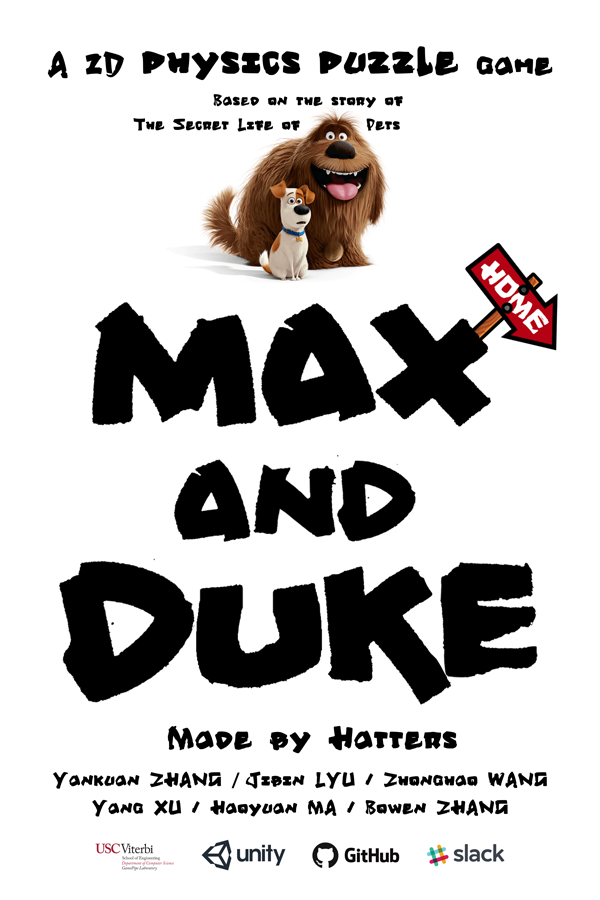
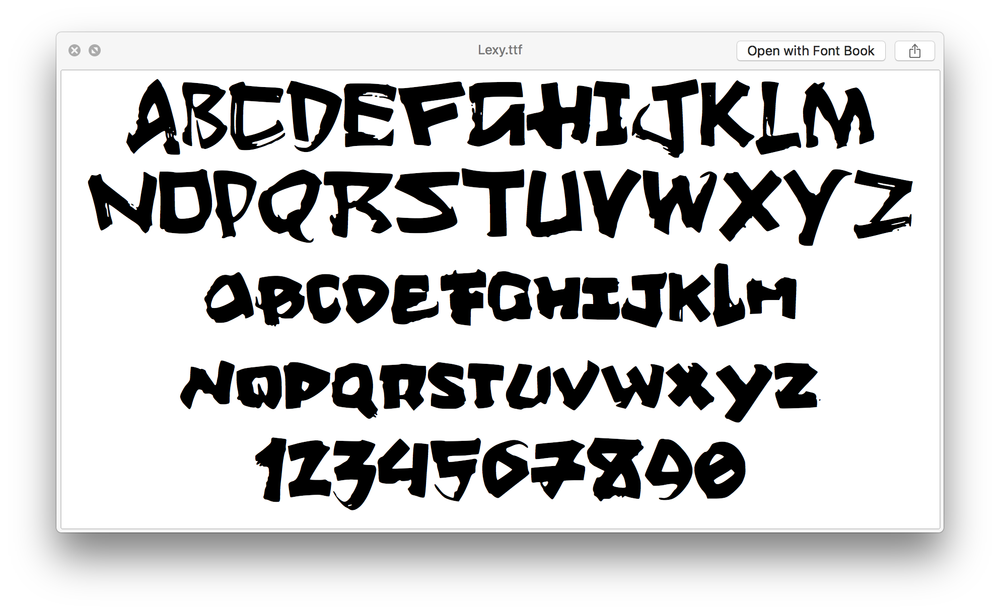
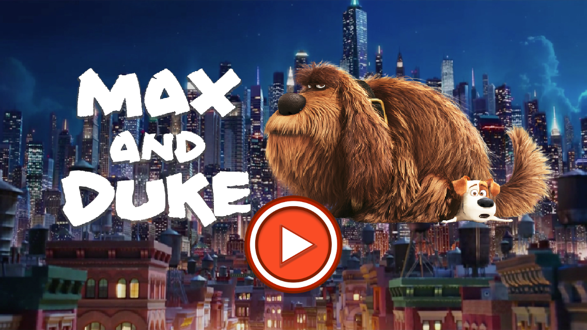
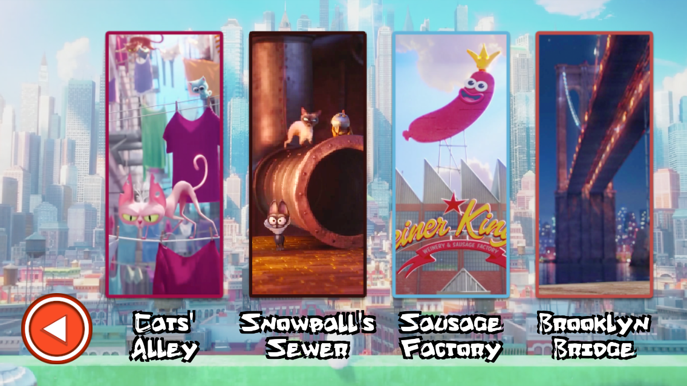
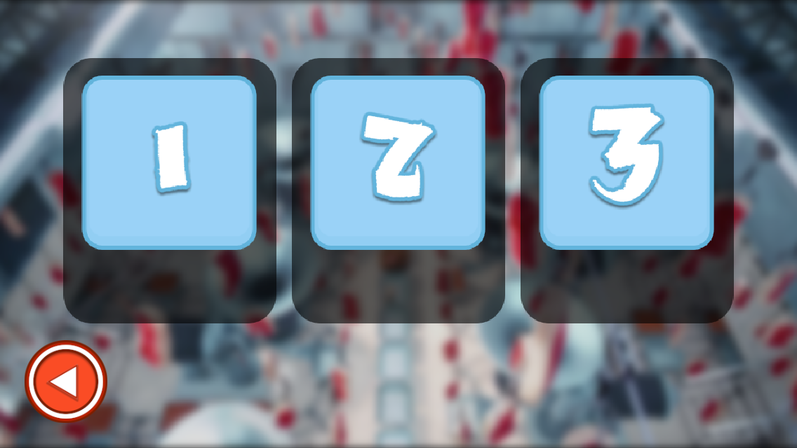
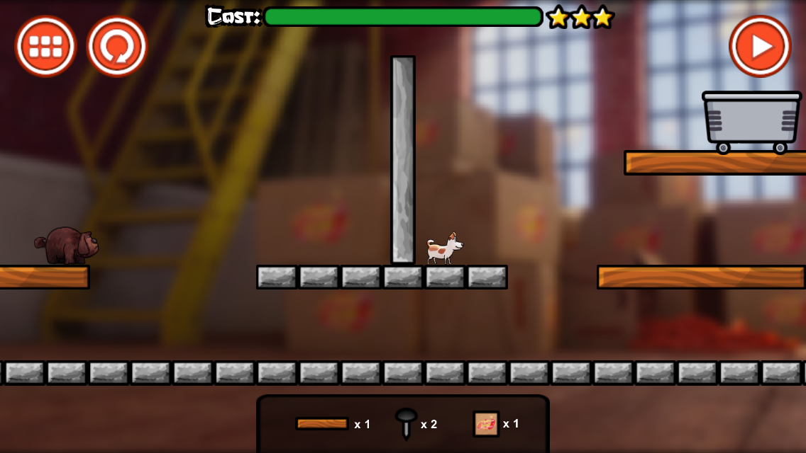
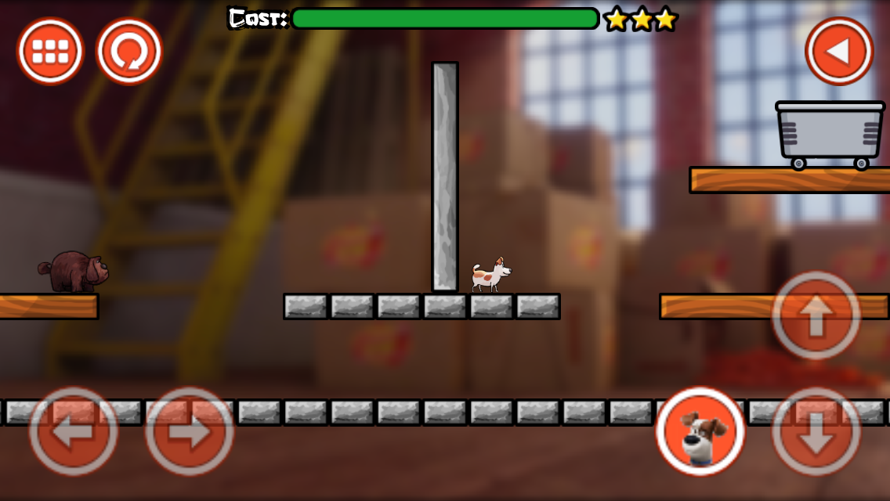
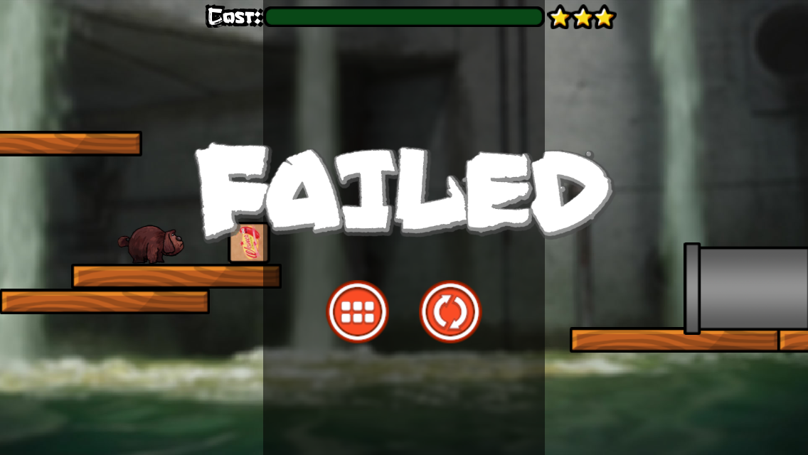
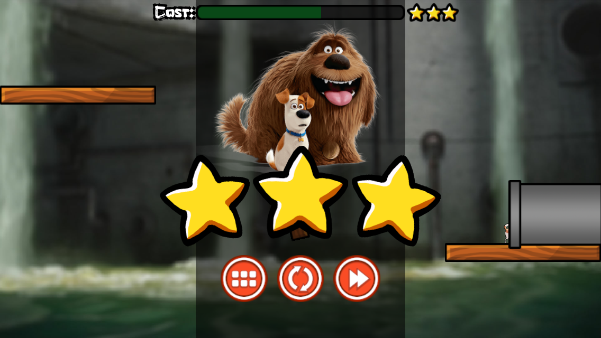
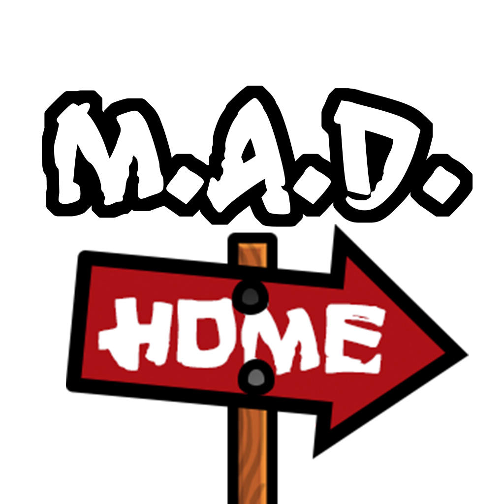

# Max and Duke (M.A.D.)

**Max and Duke** is a 2D physics puzzle game 🎮 running on iOS📱. In the game, you need to help Max and Duke go home 🏡.

## Teamwork
We are Hatters🎩! M.A.D. as Hatters! We developed **Max and Duke** with Unity in C# and maintained it on GitHub.

| Work | B. Zhang | H. Ma | J. Lyu | Y. Xu | Y. Zhang | Z. Wang | 
|:---:|:---:|:---:|:---:|:---:|:---:|:---:|
| Ideation | | | ✅ | | ✅ | | 
| [Trailer](https://youtu.be/owDAcE-v2d4) | | | ✅ | | | |
| UI/UX | | ✅ | | | ✅ | | 
| Artwork | | | | | ✅ | | 
| Testing | | | | | | ✅ | 
| [Website](http://maxandduke.weebly.com/) | ✅ | | | | | ✅ |
| Level Design | ✅ | ✅ | ✅ | ✅ | ✅ | ✅ | 
| Development | ✅ | ✅ | ✅ | ✅ | ✅ | ✅ | 

## Trailer

Without further ado, let's first watch the 130-second [trailer](https://youtu.be/owDAcE-v2d4) 🎬! This fantastic trailer is made by [@JaydenLyu](https://github.com/JaydenLyu). 

## Other Links
Here are some other useful links you may want to check:

- Max and Duke game [website](http://maxandduke.weebly.com/)
- [Game Design Document](GameDesignDocument.md)
- [Original size poster](images/madposter.png)
- [Lexy](http://bit.ly/lexytypeface), a typeface made for this game. Here is a peek of it:

## How this game looks like

Well, pretty much what you just saw in the trailer. (You watched it, didn't you? Here is a second chance: [trailer](https://youtu.be/owDAcE-v2d4) 🎬)

When you launch the game, what you will see first is:

You can select scenes (worlds):

And then select levels to play:

To pass a level, you need to go through two stages (modes):

**Deploy**, where you place tools provided from the toolbox so that you can build a route for Max and Duke. You are supposed to make the cost of tools you used as less as possible:

And **Play**, where you can control Max and Duke to go to the destination:

When you are in **Play** stage, you fail if you fall:

There are more than one solution for each level. Some of them are optimal and you can get three stars for them. Try to get all level three-starred!

Hope you like **Max and Duke**!
 

> Fall 2016, made with deadlines☠️ and coffees☕️
